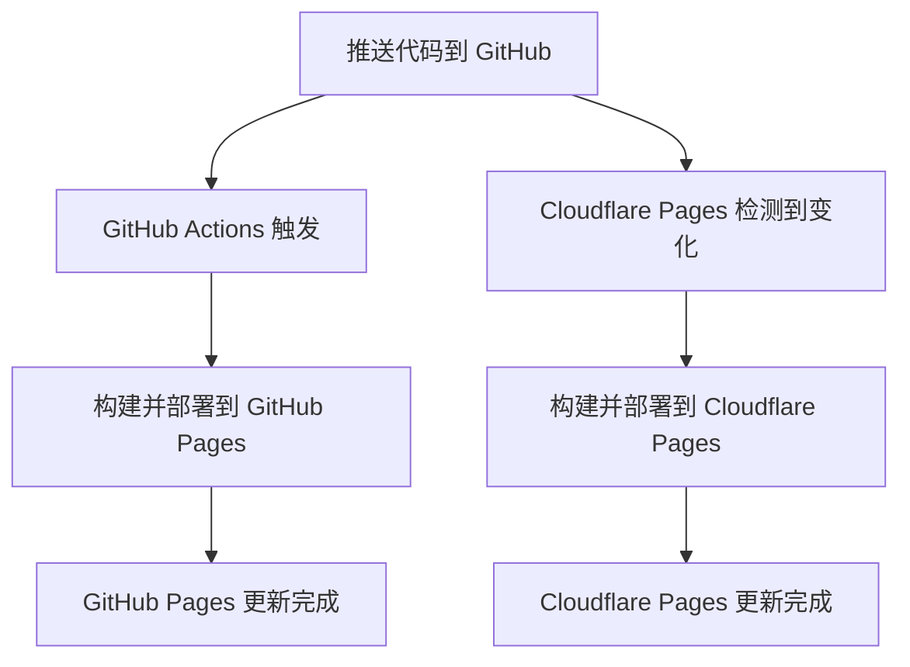

# Cloudflare Pages 简单部署指南

## 🎯 概述

这是最简单的方法：让 Cloudflare Pages 直接监听您的 GitHub 仓库，自动构建和部署。

## ✨ 优势

- ✅ **零配置复杂度** - 无需修改 GitHub Actions
- ✅ **自动同步** - 推送代码后两个平台都会更新
- ✅ **独立构建** - Cloudflare 和 GitHub Pages 独立运行
- ✅ **全球 CDN** - Cloudflare 提供更快的全球访问速度

## 🚀 5分钟设置步骤

### 第一步：登录 Cloudflare

1. 访问 [Cloudflare Dashboard](https://dash.cloudflare.com/)
2. 登录您的账户（没有账户请先注册）

### 第二步：创建 Pages 项目

1. 在左侧菜单选择 **"Pages"**
2. 点击 **"Create a project"**
3. 选择 **"Connect to Git"**

### 第三步：连接 GitHub 仓库

1. 选择 **"GitHub"** 作为 Git 提供商
2. 点击 **"Connect GitHub"** 并授权 Cloudflare 访问
3. 在仓库列表中找到您的博客仓库（如：`twj0/blog`）
4. 点击仓库名称旁的 **"Begin setup"**

### 第四步：配置构建设置

在项目配置页面填入以下信息：

#### 基本设置
- **项目名称**: `hexo-blog`（或您喜欢的名称）
- **生产分支**: `main`（或 `master`）

#### 构建配置
- **Framework preset**: 选择 `None` 或 `Hexo`
- **Build command**: `npm run build`
- **Build output directory**: `public`
- **Root directory**: `/`（保持默认）

#### 环境变量（可选但推荐）
点击 **"Environment variables (advanced)"** 添加：
- `NODE_VERSION` = `18`
- `NPM_VERSION` = `latest`

### 第五步：开始部署

1. 点击 **"Save and Deploy"**
2. Cloudflare 将开始首次构建（大约 2-3 分钟）
3. 构建完成后，您将获得一个 `.pages.dev` 域名

## 🌐 访问您的博客

部署成功后，您将有两个访问地址：

- **GitHub Pages**: `https://twj0.github.io/blog/`
- **Cloudflare Pages**: `https://hexo-blog.pages.dev`

## 🔄 自动同步工作原理



当您推送代码时：
1. **GitHub Actions** 自动构建并部署到 GitHub Pages
2. **Cloudflare Pages** 同时检测到仓库变化，独立构建并部署
3. 两个平台内容保持同步，但构建过程完全独立

## 🛠️ 自定义域名（可选）

### 为 Cloudflare Pages 添加自定义域名

1. 在 Cloudflare Pages 项目页面点击 **"Custom domains"**
2. 点击 **"Set up a custom domain"**
3. 输入您的域名（如：`blog.yourdomain.com`）
4. Cloudflare 会自动配置 DNS 和 SSL 证书

### DNS 配置示例

如果您的域名不在 Cloudflare 管理，需要添加 CNAME 记录：
- **Name**: `blog`
- **Target**: `hexo-blog.pages.dev`

## 📊 监控和管理

### 查看构建状态
- **Cloudflare Pages**: Dashboard → Pages → 您的项目 → "Deployments"
- **GitHub Pages**: 您的仓库 → Actions 页面

### 构建日志
- 在 Cloudflare Pages 项目页面可以查看详细的构建日志
- 如果构建失败，日志会显示具体错误信息

## 🔧 故障排除

### 构建失败常见原因

1. **Node.js 版本问题**
   ```
   解决方案：设置环境变量 NODE_VERSION = 18
   ```

2. **依赖安装失败**
   ```
   解决方案：检查 package.json 文件是否正确提交
   ```

3. **构建命令错误**
   ```
   解决方案：确认使用 npm run build 而不是其他命令
   ```

4. **主题文件缺失**
   ```
   解决方案：确保 themes/anzhiyu 目录已提交到仓库
   ```

### 本地测试

在推送前，建议本地测试构建：

```bash
# 清理缓存
npm run clean

# 安装依赖
npm install

# 构建静态文件
npm run build

# 检查 public 目录
ls -la public/
```

## 💡 最佳实践

1. **分支策略**: 使用 `main` 分支作为生产分支
2. **提交频率**: 小而频繁的提交比大的提交更好
3. **构建监控**: 定期检查两个平台的构建状态
4. **性能对比**: 比较两个平台的访问速度，选择更适合您用户的平台

## 🎉 完成！

现在您的博客已经成功部署到两个平台：
- ⚡ **GitHub Pages** - 适合开发者访问
- 🌐 **Cloudflare Pages** - 全球 CDN 加速，更快的访问速度

每次您推送新内容时，两个平台都会自动更新！
